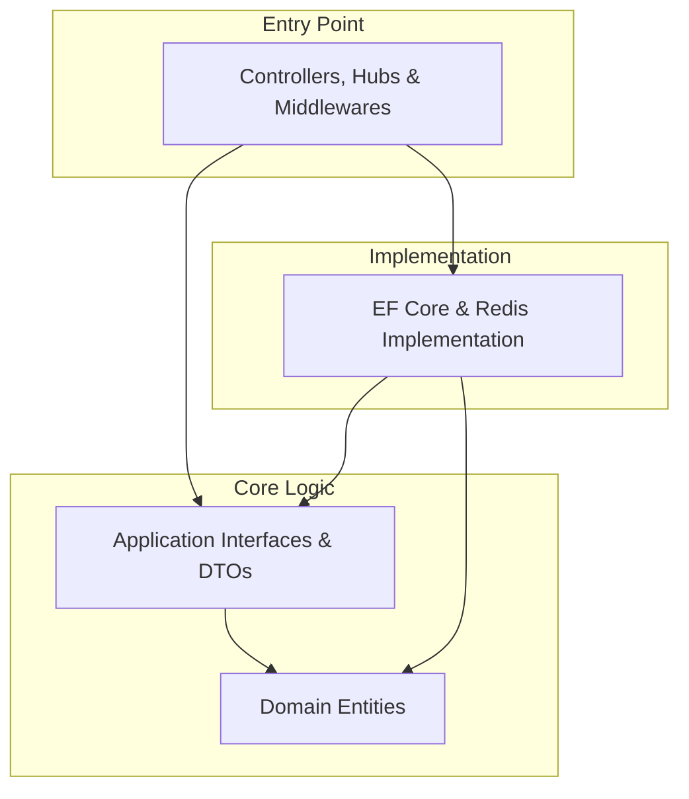

# 🛡️ GM-Tools-Admin

> **基于 .NET 10 与 Vue 3 的硬核游戏后台管理系统**  
> *Hardcore Game Operation Management System based on .NET 10 & Vue 3*

[](https://dotnet.microsoft.com/)
[](https://vuejs.org/)
[](LICENSE)
[]()

## 📖 项目简介 (Introduction)

**GM-Tools-Admin** 是为高并发游戏场景设计的生产级运营管理平台。它不仅仅是一个 CRUD 后台，更是一个集成了**资产安全管控**、**大规模异步指令调度**及**实时状态同步**的现代化解决方案。

核心定位：
*   🔒 **资产安全**: 解决游戏运营中最敏感的“物品发放”与“货币扣除”安全问题，杜绝超卖与竞态条件。
*   ⚡ **高并发调度**: 优雅处理成千上万的玩家封禁/解封指令，保护核心数据库不受冲击。
*   📡 **实时反馈**: 打破 HTTP 请求响应的界限，实现操作结果的毫秒级 WebSocket 推送。

---

## 🛠️ 技术栈看板 (Tech Stack)

### Backend (Core)
*   **Running Runtime**: [.NET 10 (Preview)](https://dotnet.microsoft.com/en-us/download/dotnet/10.0) - 探索 C# 13 的极致性能。
*   **ORM**: Entity Framework Core 10 - 结合 PostgreSQL 17 的强大能力。
*   **Infrastructure**: StackExchange.Redis - 分布式锁与高速缓存。
*   **Real-time**: ASP.NET Core SignalR - 高性能 WebSocket 通讯。

### High Performance
*   **System.Threading.Channels**: 内存级生产者-消费者队列，实现 Backpressure (背压) 机制。
*   **MiniExcel**: 基于流式 IO 的高性能 Excel 处理组件，内存占用极低。

### Frontend
*   **Framework**: Vue 3.5 (Composition API) + TypeScript 5.9.
*   **UI System**: Element Plus 2.13 - 深度定制的暗黑模式 (Dark Mode)。
*   **Tooling**: Vite 7.2 - 极速冷启动与热更新 (HMR)。

---

## 🔥 核心硬核特性 (Hardcore Features)

### 1. 🛡️ 分布式锁与原子性 (Distributed Lock & Atomicity)
在涉及玩家金币扣除 (`DeductGold`) 的高危操作中，我们构建了类似金融系统的双重防线：
*   **Layer 1 (Redis)**: 使用 `StackExchange.Redis` 实现分布式互斥锁 (`SET key val NX EX`)，确保同一玩家同一时间只能处理一个请求。
*   **Layer 2 (DB Optimistic Locking)**: 利用 SQL 原子更新语句 `UPDATE players SET gold = gold - @amount WHERE id = @id AND gold >= @amount`。即使并发穿透了 Redis 锁，数据库层面的 **Condition Update** 也能保证余额**永不超卖**。

### 2. 🌊 生产者-消费者限流队列 (Rate-Limited Queue)
面对突发的“批量封禁”需求（如 10万+ 违规账号），直接写入数据库会导致连接池耗尽。
*   **BanQueueService**: 采用 `System.Threading.Channels.Channel<T>` 构建有界队列。
*   **Rate Limiting**: 消费者线程被限制为 **50 TPS**，通过 `await Task.Delay` 平滑流量削峰。
*   **Backpressure**: 当队列满时 (`BoundedChannelFullMode.Wait`)，自动阻塞 API 生产者，防止内存溢出 (OOM)。

### 3. 🔐 AOP 切面安全防线 (Aspect-Oriented Security)
敏感操作（如扣除金币）不应依赖前端验证。我们通过自定义 `ActionFilter` 实现“插拔式”安全增强：
*   **[RequireSecondaryAuth]**: 任何标记此 Attribute 的 Controller Action，请求头中必须包含有效的 `X-Secondary-Password`。
*   **Short-circuiting**: 验证失败直接返回 401，根本不会进入业务逻辑层，实现关注点分离。

### 4. 📊 流式审计系统 (Streaming Audit)
告别 `DataTable` 整表加载导致的内存崩溃。
*   **Memory Efficiency**: 利用 `IAsyncEnumerable<T>` 和迭代器模式，数据从数据库游标 (Cursor) 读出后直接流入网络响应流 (Network Stream)。
*   **Zero-Copy**: 结合 MiniExcel 的流式写入能力，理论上支持无限行数的日志导出，服务器内存占用恒定 (O(1))。

---

## ⚡ 快速开始 (Quick Start)

### 后端 (Backend)

1.  **环境准备**: 确保已安装 .NET 10 SDK、PostgreSQL 和 Redis。
2.  **配置数据库**: 修改 `appsettings.json` 中的 `ConnectionStrings:DefaultConnection` 和 `Redis`。
3.  **应用迁移**:
    ```bash
    cd GameAdmin.Infrastructure
    dotnet ef database update --startup-project ../GameAdmin.Api
    ```
4.  **启动服务**:
    ```bash
    cd GameAdmin.Api
    dotnet run
    ```

### 前端 (Frontend)

1.  **安装依赖**:
    ```bash
    cd game-admin-ui
    npm install
    ```
2.  **启动开发服**:
    ```bash
    npm run dev
    ```

---

## 🏛️ 架构示意图 (Architecture)

项目严格遵循 **Clean Architecture** (整洁架构) 原则，实现关注点分离：



*   **API**: 仅负责 HTTP/WebSocket 协议处理、全局异常捕获。
*   **Application**: 纯净的业务规则定义，不依赖任何数据库具体实现。
*   **Infrastructure**: 所有的“脏活累活”（SQL读写、Redis操作、第三方API）都在这里，实现了 Interface。
*   **Domain**: 核心领域模型（Player, GmOperationLog），POCO 对象，无依赖。

---

## 🚀 未来演进 (Future Roadmap)

*   [ ] **C++ Native Module**: 计划引入自研 C++ 扩展 (`.dll / .so`) 接管高频日志文件的解析与处理，进一步压榨 CPU 性能。
*   [ ] **gRPC Support**: 为微服务架构准备，提供高性能的内部 RPC 接口。
*   [ ] **AI Copilot Integration**: 集成 LLM 辅助管理员进行异常数据分析。

---

Managed with ❤️ by [Your Organization]
